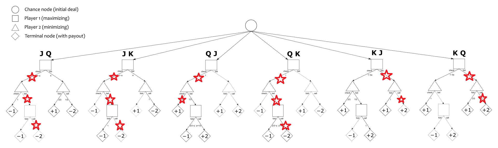

# Exploring Counterfactual Regret Minimization for Small Imperfect Information Games

## Summary

Per my project proposal, I intended to tackle three games covered in ["An Introduction to Counterfactual Regret Minimization"](http://modelai.gettysburg.edu/2013/cfr/cfr.pdf "Paper Reference"): Kuhn Poker, Dudo, and Liar Die.  I swapped Dudo out for Rock-Paper-Scissors (RPS). I felt like working through RPS would benefit my own learning and allow me to explore the broadest depth of techniques within CFR (Both Kuhn Poker and Dudo use the same algorithm).  I use RPS to look at the foundation of CFR in the context of a one-shot game.  Kuhn Poker demonstrates how CFR concepts are extrapolated to sequential games.  Liar Die demonstrates how dynamic programming can improve CFR algorithms.  All code is heavily based off the language-agnostic code and pseudocode presented in the above paper.

## Rock Paper Scissors

### Rules and Game Theory Intro

I probably don't need to rehash what rock paper scissors entails but I will do so to explain some fundamental game theory concepts. Each games has
* N = {1,...,n} a finite set of players
* Si = a finite set of actions for player i
* A = S1 X ... X Sn set of all possible combinations of simultaneous actions (action profile)
* u is a map from an action profile to a vector of utilities for each player
 
I mentioned above that RPS is considered a one-shot game.  This is because each player makes a single decision and the game reaches a terminal state.  This makes RPS and equivalently complex games a great playgroud for exploring CFR ideas.  The first thing to talk about is utility.  Below is a table of utilities where the first player chooses a row and the second player chooses a column.  Ties grant 0 utility for both players whereas winning grants 1 and losing grants -1. Regret is defined as positive differences in the utility of possible actions and the action taken. To illustrate, consider the case where you play rock and your opponent plays paper. You are sad you did not play paper (regret = 0 - (-1) = 1), but even more sad that you did not play scissors (regret = 1 - (-1) = 2).  Regret for not playing the winning move is stronger than regret for not playing the tying move.

 
 

|   | R     | P     | S     |
|---|-------|-------|-------|
| R | 0, 0  | -1, 1 | 1, -1 |
| P | 1, -1 | 0, 0  | -1, 1 |
| S | -1, 1 | 1, -1 | 0, 0  |

 

With the notion of utilities and regret we can start to talk about strategies.  Two big classes of strategies are pure strategies and mixed strategies.  A pure strategy refers to always picking a particular move or sequency of moves in response to a situation.  A mixed strategy refers to choosing from a set of moves with a certain probability for each move.

 

The first big idea in CFR is something called Regret Matching.  The jist is that as you play you can keep track of your past regrets and adopt a strategy in proportion to or matching these regret sums.  For example, if your regret sums are [R, P, S] = [1, 4, 1] you can adopt the mixed strategy [1/6, 2/3, 1/6] (play R with probability 1/6, play P with probability 2/3, and play S with probability 1/6).  Applying this regret matching directly a game is easily exploited by opponents who understand regret matching.  Therefore, we instead engage in many training or self-play iterations where in each iteration we

1. Use regret matching to calculate a strategy
2. Add this strategy to a sum of all strategies
3. Select a player action from this strategy
4. Calculate and accumulate regrets

The average strategy should slowly converge to a equilibrium solution.  The biggest misconception with CFR is that the current strategy converges to a solution, but it is the average strategy that will eventually yield the solution. There are several types of solutions to games (the most common being a Nash equilibrium).  In the case of a Nash equilbrium neither player can improve their utilities through a change in strategy assuming their opponent keeps the same strategy.

### Approach

The code for performing CFR on RPS can fit in one class called RPSTrainer which holds some constants for the game definition and keeps track of strategies and regrets for both the player and the opponent.  I explored two situations of RPS:

* The opponent uses a fixed mixed strategy and the Player uses CFR to learn their strategy
* Both players use CFR to learn their strategy

### Results

Here are graphs for the first situation (probability of action vs number of training iterations passed).  The opponent favors rock to paper and paper scissors using the (.5,.3,.2) strategy

CFR quickly converges to player oppting to nearly always play paper to abuse the bias in the opponents strategy

Here are graphs for the second situation in the same format both the opponent and playerconverge to the (.33,.33,.33) solution

## Kuhn Poker

### Rules

As I mentioned above Kuhn Poker is a step from the world of one-shot games to the realm of sequential games. The rules are as follows

* 2 players
* 3 cards 1,2,3 or J,Q,K
* 1 chip ante from each player
* Cards are shuffled and one is dealt to each player with the remaining card kept hidden
* Players alternate starting with P1
* Players have two options: pass (add nothing to pot) or bet (add one to pot)
* Two of the same move in a row ends the game with the pot going to the higher card
* A pass after a bet ends the game withe the pot going to betting player

Here is another table from the CFR introduction paper that serves to better demonstrate the cases

 
 

| Player 1 | Player 2 | Player 1 | Payoff           |
|----------|----------|----------|------------------|
| pass     | pass     |          | 1 to higher card |
| pass     | bet      | pass     | 1 to Player 2    |
| pass     | bet      | bet      | 2 to higher card |
| bet      | pass     |          | 1 to Player 1    |
| bet      | bet      |          | 2 to higher card |

 

### Approach

There are a couple of options when it comes to encoding a sequential game for CFR. Using a game tree is the method preferred by the paper and is fairly common in other literature.  There are three types of nodes:

* Chance nodes, no decision is made here but a chance event occurs.  There is one chance node for Kuhn Poker, dealing the cards
* Decision nodes, a player makes a decision
* Terminal nodes, contains a payoff

Each decision node contains an information set which is comprised of all the information available to the acting player.  For example if player 1 bet and player 2 had card 3 the information set for player 2 would contain those two pieces of information.  Notice that this information set encompasses 2 gamestates: player 1 has either card 1 or card 3.  There are 12 information sets for kuhn poker and each information set contains 2 possbile games states.

* 1
* 1b
* 1p
* 1pb
* 2
* 2b
* 2p
* 2pb
* 3
* 3b
* 3p
* 3pb

We can pass histories down through the nodes and utilities back up through the nodes through a recursive processes.  See section 3.3 of the intro CFR paper for details.

Kuhn poker also introduces the idea of "chance sampling".  Instead of computing chance events within he recursive CFR calls, we shuffle and deal the cards up front.  CFR can be introduced with our without chance sampling and there are many varieties of chance sampling to choose from.  The paper recomends using a Fisher-Yates shuffle on three card list and then grab the first two cards and the deal for players 1 and 2 respectively.

### Results

Here is what a game tree and parameterized mixed solution look like for kuhn poker (its a little hard to see you might have to zoom in).  By parameterized I mean alpha takes on a value of from the set [0, 1/3].  This is just one class of possible solutions

Here is that same tree with red stars where my solution leads to playing

Clearly there is something very wrong with my solution, but after ~6 hours of debugging I have been unable to find
my error. After this project is over I plan to rewrite my code to see if that can fix it.  More evidence that my 
solution is flawed Is the average utility of a game of Kuhn Poker. The reference texts indicate the expected utility of the first player at the equilibrium solution is -1/18.  My code converges on an expected utility of ~1.8.  My suspicion is that I am messing up the sign that get assigned to some of the utilities.  Debugging with iteration inside of recursion with the current player swapping each call was a little bit of a headache. Recently, I found another repo whose implementation (I think) is favorable to my own beyond the fact that it works. ["External CFR Kuhn Poker Solution"](https://github.com/int8/counterfactual-regret-minimization "Github Reference").  The structure of their code is much more flexible/easily adaptable to other games.  I will review this going forward.

## Liar Die

### Rules

Here are rules for Liar Die:

* Player 1 rolls a s-sided die and keeps the result secret then makes a claim for the roll rank (s = 6 in my code)
* Player 2 can either doubt or accept
  * Doubt: The roll is revealed and compared to the rank.  If roll >= claimed rank player 1 wins else player 2 wins
  * Accept: Roll remains unrevealed and player 2 gets to roll and claim with the exception that their claim must be higher than the preivous claim
* Gameplay continues in this fashion until a player doubts

### Approach

It is common for different histories to lead to the same information set within a number of games.  Take liar die for example, the only information that matters is the past two claims (current claim and its bounding claim). Identical information sets have the same strategy so calculating that identical strategy for each history that arrives at that information set is wasteful.  We can forego recursion in favor of some dynamic programming to avoid this waste.  The recursive CFR process can be broken into two iterative processes: a forward pass and a backward pass.  This technique is usually refereed to as Fixed-Strategy Iteration CFR or FSICFR.

 

For this game we can break decision nodes down into claim nodes and response nodes.
* Response nodes are indexed by two most recent claims and have two options doubt or accept
* Claim nodes are indexed by the previous claim (bounding claim) and can choose anything larger than bounding claim but smaller than or equal to the max number of sides

 

This setup removes game information that is uneccessary to making a decision and allows us to leverage the FSICFR strategy.

 

This game also introduces an iteresting augment to improve your results.  Halfway through training, we reset our strategy sums to 0.  That way, the FSICFR solution is only the average of the strategies used during the later half of the game. Neller and Lanctot recommmend trying the algorithm with and without the augmentation. I saw minimial change in my outcomes when toggling the feature on and off

### Results

My solution seems to be very flawed here as well. here are some tables the provide strategies for response nodes and game nodes.

#### Response Nodes

 

| Old Claim | New Claim | Probability Doubt | Probability Accept |
|-----------|-----------|-------------------|--------------------|
| 0         | 1         | .5                | .5                 |
| 0         | 2         | .5                | .5                 |
| 0         | 3         | .5                | .5                 |
| 0         | 4         | 1                 | 0                  |
| 0         | 5         | 1                 | 0                  |
| 0         | 6         | 1                 | 0                  |
| 1         | 2         | .5                | .5                 |
| 1         | 3         | .5                | .5                 |
| 1         | 4         | .5                | .5                 |
| 1         | 5         | 1                 | 0                  |
| 1         | 6         | 1                 | 0                  |
| 2         | 3         | .5                | .5                 |
| 2         | 4         | .92               | .08                |
| 2         | 5         | 1                 | 0                  |
| 2         | 6         | 1                 | 0                  |
| 3         | 4         | .53               | .47                |
| 3         | 5         | 1                 | 0                  |
| 3         | 6         | 1                 | 0                  |
| 4         | 5         | 1                 | 0                  |
| 4         | 6         | 1                 | 0                  |
| 5         | 6         | 1                 | 0                  |

 

#### Claim Nodes

 

| Old Claim | Roll | Prob 1 | Prob 2 | Prob 3 | Prob 4 | Prob 5 | Prob 6 |
|-----------|------|--------|--------|--------|--------|--------|--------|
| 0         | 1    | 1/6    | 1/6    | 1/6    | 1/6    | 1/6    | 1/6    |
| 0         | 2    | 1/6    | 1/6    | 1/6    | 1/6    | 1/6    | 1/6    |
| 0         | 3    | 1/6    | 1/6    | 1/6    | 1/6    | 1/6    | 1/6    |
| 0         | 4    | 1/6    | 1/6    | 1/6    | 1/6    | 1/6    | 1/6    |
| 0         | 5    | 1/6    | 1/6    | 1/6    | 1/6    | 1/6    | 1/6    |
| 0         | 6    | 1/6    | 1/6    | 1/6    | 1/6    | 1/6    | 1/6    |
| 1         | 1    | 0      | 1/5    | 1/5    | 1/5    | 1/5    | 1/5    |
| 1         | 2    | 0      | 1/5    | 1/5    | 1/5    | 1/5    | 1/5    |
| 1         | 3    | 0      | 1/5    | 1/5    | 1/5    | 1/5    | 1/5    |
| 1         | 4    | 0      | 1/5    | 1/5    | 1/5    | 1/5    | 1/5    |
| 1         | 5    | 0      | 1/5    | 1/5    | 1/5    | 1/5    | 1/5    |
| 1         | 6    | 0      | 1/5    | 1/5    | 1/5    | 1/5    | 1/5    |
| 2         | 1    | 0      | 0      | 1/4    | 1/4    | 1/4    | 1/4    |
| 2         | 2    | 0      | 0      | 1/4    | 1/4    | 1/4    | 1/4    |
| 2         | 3    | 0      | 0      | 1/4    | 1/4    | 1/4    | 1/4    |
| 2         | 4    | 0      | 0      | 1/4    | 1/4    | 1/4    | 1/4    |
| 2         | 5    | 0      | 0      | 1/4    | 1/4    | 1/4    | 1/4    |
| 2         | 6    | 0      | 0      | 1/4    | 1/4    | 1/4    | 1/4    |
| 3         | 1    | 0      | 0      | 0      | 1/3    | 1/3    | 1/3    |
| 3         | 2    | 0      | 0      | 0      | 1/3    | 1/3    | 1/3    |
| 3         | 3    | 0      | 0      | 0      | 1/3    | 1/3    | 1/3    |
| 3         | 4    | 0      | 0      | 0      | 1/3    | 1/3    | 1/3    |
| 3         | 5    | 0      | 0      | 0      | 1/3    | 1/3    | 1/3    |
| 3         | 6    | 0      | 0      | 0      | 1/3    | 1/3    | 1/3    |
| 4         | 1    | 0      | 0      | 0      | 0      | 1/2    | 1/2    |
| 4         | 2    | 0      | 0      | 0      | 0      | 1/2    | 1/2    |
| 4         | 3    | 0      | 0      | 0      | 0      | 1/2    | 1/2    |
| 4         | 4    | 0      | 0      | 0      | 0      | 1/2    | 1/2    |
| 4         | 5    | 0      | 0      | 0      | 0      | 1/2    | 1/2    |
| 4         | 6    | 0      | 0      | 0      | 0      | 1/2    | 1/2    |
| 5         | 1    | 0      | 0      | 0      | 0      | 0      | 1      |
| 5         | 2    | 0      | 0      | 0      | 0      | 0      | 1      |
| 5         | 3    | 0      | 0      | 0      | 0      | 0      | 1      |
| 5         | 4    | 0      | 0      | 0      | 0      | 0      | 1      |
| 5         | 5    | 0      | 0      | 0      | 0      | 0      | 1      |
| 5         | 6    | 0      | 0      | 0      | 0      | 0      | 1      |

 

There seems to be a problem accumulating regrets for claim nodes because they default to a uniform mixed strategy.  After significant debugging effort, I am struggling to find the cause.  There are also some questionable strateies on the response side.  See the first row where there is only a single claim of 1.  My strategy suggests picking accept and doubt with equal probability .5, but the roll will always be greater than or equal to 1 therefore choosing doubt would be a guarenteed loss.  I found this to be a useful debugging strategy to get RPS working earlier.  Just making some common sense checks is a good way to see if you are on the right path.

## Conclusion

The current form of my code is much less modular than I was expecting. Much of the structure of my CFR algorithms are tied down to game specific details. For example, classifying the descision nodes as either claim or response nodes specializes the algorithm for liar die. Another example of this is the encoding of information sets in a dictionary indexed by a string. The paper makes mention that its pseudocode is not close to the best implementation of these algorithms and that they were aiming for the most evocative/understandable representation.  The other implementation for Kuhn poker I linked above is more faithful to the theory. There is a lot of room left to grow in terms of my understanding of CFR.  I would first like to get my Kuhn poker and Liar Die algorithms nailed down and then move on to 3-player games.  Moreover, the paper features discussion on prunning the game tree after the converging strategy indicates that a particular path of play in unviable.  Deep CFR offers even another layer by using deep neural networks to approximate the behavior of CFR for especially large game trees.  This comes with the added benefit of avoiding some game-specific heuristics that are usually required to make large game trees tractable.

## References
