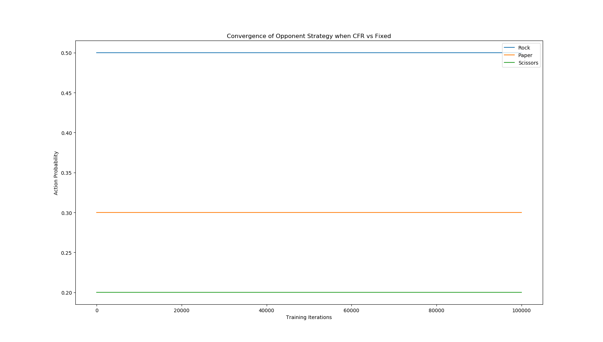
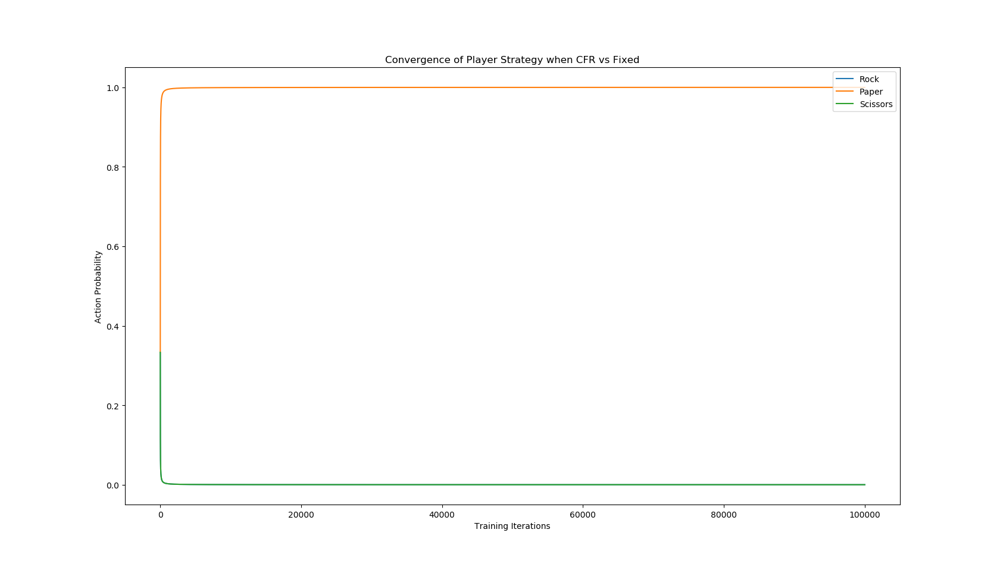
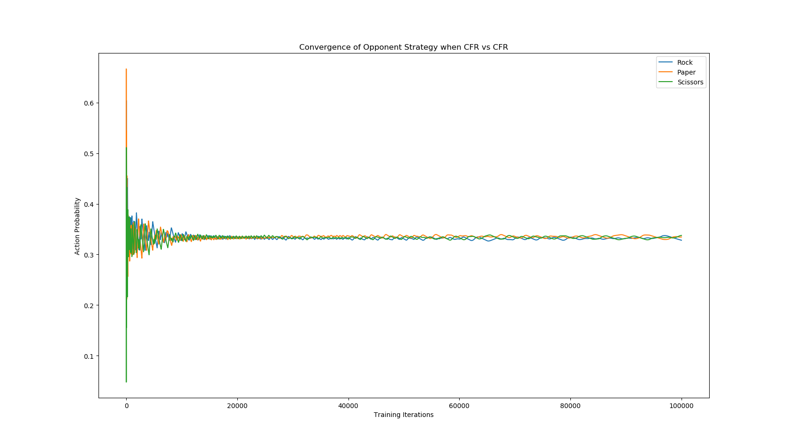
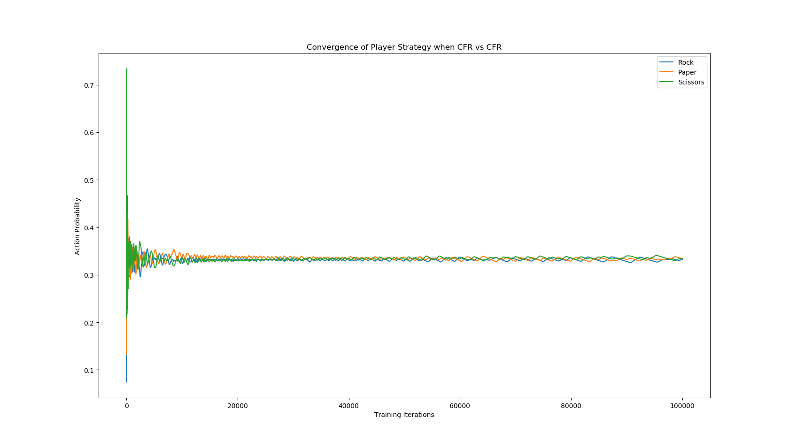

# Exploring Counterfactual Regret Minimization for Small Imperfect Information Games

## Summary

Per my project proposal, I intended to tackle three games covered in ["An Introduction to Counterfactual Regret Minimization"](http://modelai.gettysburg.edu/2013/cfr/cfr.pdf "Paper Reference"): Kuhn Poker, Dudo, and Liar Die.  I swapped Dudo out for Rock-Paper-Scissors (RPS). I felt like working through RPS would benefit my own learning and allow me to explore the broadest depth of techniques within CFR (Both Kuhn Poker and Dudo use the same algorithm).  I use RPS to look at the foundation of CFR in the context of a one-shot game.  Kuhn Poker demonstrates how CFR concepts are extrapolated to sequential games.  Liar Die demonstrates how dynamic programming can improve CFR algorithms.  All code is heavily based off the language-agnostic code and pseudocode presented in the above paper.

## Rock Paper Scissors

### Rules and Game Theory Intro

I probably don't need to rehash what rock paper scissors entails but I will do so to explain some fundamental game theory concepts. Each games has
* N = {1,...,n} a finite set of players
* Si = a finite set of actions for player i
* A = S1 X ... X Sn set of all possible combinations of simultaneous actions (action profile)
* u is a map from an action profile to a vector of utilities for each player
 
I mentioned above that RPS is considered a one-shot game.  This is because each player makes a single decision and the game reaches a terminal state.  This makes RPS and equivalently complex games a great playgroud for exploring CFR ideas.  The first thing to talk about is utility.  Below is a table of utilities where the first player chooses a row and the second player chooses a column.  Ties grant 0 utility for both players whereas winning grants 1 and losing grants -1. Regret is defined as positive differences in the utility of possible actions and the action taken. To illustrate, consider the case where you play rock and your opponent plays paper. You are sad you did not play paper (regret = 0 - (-1) = 1), but even more sad that you did not play scissors (regret = 1 - (-1) = 2).  Regret for not playing the winning move is stronger than regret for not playing the tying move.

 
 

|   | R     | P     | S     |
|---|-------|-------|-------|
| R | 0, 0  | -1, 1 | 1, -1 |
| P | 1, -1 | 0, 0  | -1, 1 |
| S | -1, 1 | 1, -1 | 0, 0  |

 

With the notion of utilities and regret we can start to talk about strategies.  Two big classes of strategies are pure strategies and mixed strategies.  A pure strategy refers to always picking a particular move or sequency of moves in response to a situation.  A mixed strategy refers to choosing from a set of moves with a certain probability for each move.

 

The first big idea in CFR is something called Regret Matching.  The jist is that as you play you can keep track of your past regrets and adopt a strategy in proportion to or matching these regret sums.  For example, if your regret sums are [R, P, S] = [1, 4, 1] you can adopt the mixed strategy [1/6, 2/3, 1/6] (play R with probability 1/6, play P with probability 2/3, and play S with probability 1/6).  Applying this regret matching directly a game is easily exploited by opponents who understand regret matching.  Therefore, we instead engage in many training or self-play iterations where in each iteration we

1. Use regret matching to calculate a strategy
2. Add this strategy to a sum of all strategies
3. Select a player action from this strategy
4. Calculate and accumulate regrets

The average strategy should slowly converge to a equilibrium solution.  The biggest misconception with CFR is that the current strategy converges to a solution, but it is the average strategy that will eventually yield the solution. There are several types of solutions to games (the most common being a Nash equilibrium).  In the case of a Nash equilbrium neither player can improve their utilities through a change in strategy assuming their opponent keeps the same strategy.

### Approach

The code for performing CFR on RPS can fit in one class called RPSTrainer which holds some constants for the game definition and keeps track of strategies and regrets for both the player and the opponent.  I explored two situations of RPS:

* The opponent uses a fixed mixed strategy and the Player uses CFR to learn their strategy
* Both players use CFR to learn their strategy

### Results

Here are graphs for the first situation (probability of action vs number of training iterations passed).  The opponent favors rock to paper and paper scissors using the (.5,.3,.2) strategy

CFR quickly converges to player oppting to nearly always play paper to abuse the bias in the opponents strategy

Here are graphs for the second situation in the same format both the opponent and playerconverge to the (.33,.33,.33) solution

## Kuhn Poker

### Rules

As I mentioned above Kuhn Poker is a step 

### Approach

### Results

## Liar Die

### Rules

### Approach

### Results

## Conclusion

The current form of my code is much less modular than I was expecting.  Much of the structure of my CFR algorithm is tied down 
